# PLAN2SHIFT — Product & Technical Book

> **One document, three reading layers.**
> **L1 · The Pitch** — for investors, partners, executives (5-minute read).
> **L2 · The Product** — for the product team; what we build, why, and how we know it works.
> **L3 · The Technical** — for engineering & ops; the source of truth for architecture and operations.
> **Appendices** — risks, compliance calendar, glossary, decision log — for everyone.

| | |
|---|---|
| **Status** | Research + planning. **No product build until the owner says "build".** Phase-0 groundwork partially delivered by colleague (multi-tenancy, auth hardening). |
| **Repo HEAD** | `5708154` (2026-09-06) — HttpOnly cookie auth, multi-tenant foundation, 9 Dutch roles, permission matrix, dashboard shell, TOTP support codes, security.txt / Terms / Web Analytics / GTranslate |
| **Version** | 1.0.0 |
| **Last updated** | 2026-09-06 |
| **Maintainers** | Owner (RAGNAROK) + colleague (ZeroMeister) + AI swarm (AI BRAIN) |
| **Living doc** | Updated every planning cycle from the machine-brain knowledge base |

---

## Table of Contents

1. [Executive Summary](#1-executive-summary) *(L1)*
2. [Vision & Mission](#2-vision--mission) *(L1)*
3. [The Problem](#3-the-problem) *(L1)*
4. [Market & Competition](#4-market--competition) *(L1)*
5. [Business Model & Unit Economics](#5-business-model--unit-economics) *(L1)*
6. [Roadmap at a Glance](#6-roadmap-at-a-glance) *(L1)*
7. [Personas & User Stories](#7-personas--user-stories) *(L2)*
8. [Product Scope & Roadmap Detail](#8-product-scope--roadmap-detail) *(L2)*
9. [Feature Deep-Dives](#9-feature-deep-dives) *(L2)*
10. [UX Principles](#10-ux-principles) *(L2)*
11. [KPIs & Release Criteria](#11-kpis--release-criteria) *(L2)*
12. [Localization Strategy](#12-localization-strategy) *(L2)*
13. [Go-to-Market](#13-go-to-market) *(L2)*
14. [Architecture](#14-architecture) *(L3)*
15. [Data Model](#15-data-model) *(L3)*
16. [Security & Compliance](#16-security--compliance) *(L3)*
17. [Integrations Matrix](#17-integrations-matrix) *(L3)*
18. [Operations](#18-operations) *(L3)*
19. [Testing & Quality](#19-testing--quality) *(L3)*
20. [Risks & Compliance Calendar](#20-risks--compliance-calendar) *(All)*
21. [Glossary](#21-glossary-dutch--english) *(All)*
22. [Decision Log & Open Questions](#22-decision-log--open-questions) *(All)*

---

# L1 · THE PITCH LAYER

## 1. Executive Summary

**Plan2Shift replaces the chaos stack** — Excel rosters + WhatsApp group chats + payroll portals + map apps + emails + sick-leave phone calls + shift-swap hunts — that every shift-based company juggles today, **with one platform**: the rota, clocking, absence, pay-information, and HR data in a single place where a worker can see and do everything and a team-leader can plan with status clarity.

**The wedge is the roster.** The hero screen is a color-coded roster — **green / yellow / red** — that shows at a glance whether every shift is covered, is at risk, or is uncovered. We pair it with the legal certainty that competitors treat as an afterthought: **Dutch CAO, ATW youth-work and rest rules checked at scheduling time, not after the fact.** Our power-user slogan: *"The roster sells the session; HR-ESS sells the contract."*

**We integrate, never re-invent.** Payroll is a link to trusted vendors (Nmbrs, later AFAS/Exact) — we never rebuild payroll compute. The result is a defensible position: a scheduling + time + absence + HR platform built for the **European shift-work market (horeca first)**, at a price a small venue can afford (free ≤ 5 employees forever; from €4/seat/month).

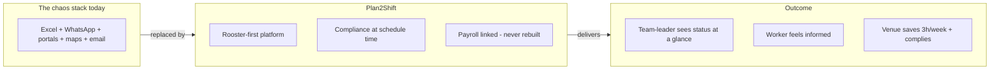

**Where we are.** The foundation is already landing: a colleague's update shipped **multi-tenancy, a 9-role Dutch permission matrix, a role-filtered dashboard shell, and TOTP support codes** (2026-09-06). The machine-brain holds 69 validated notes of research: market landscape (~160 apps), 28 evidence sections, unit economics, a 12-item Phase-1 PRD, and locked product decisions. Next gate: **owner-says-build** → Phase 0 security completion → Phase 1 horeca MVP with 3 paid pilot venues.

---

## 2. Vision & Mission

> **Vision.** Every shift-based company in Europe runs its operations on one platform: who is working, who is in, who is out, what they earn, and what the law says — with a worker who feels informed and a team-leader who plans with clarity.

> **Mission.** Be the platform a small hospitality venue adopts on a weekend, keeps because the roster is finally predictable, and stays with because the payroll is linked and HR data lives in one place.

### Ambition (who it serves — every sector, in sequence)

| Sector ambition | Phase |
|---|---|
| Horeca (restaurants, cafés, hotels, catering) | **Phase 1** |
| Retail / Cleaning / Zorg-VVT (choose one, with a pilot employer) | Phase 2 |
| Factories & production (ploegendienst) | Phase 3 |
| Gemeente, MKB-general, online/remote, contractors, jobs finder, internships | Later |

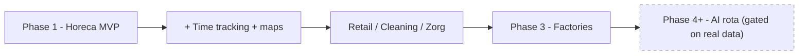

### Principles (locked)

1. **Own product** — inspired by existing tools, never a clone. Built from our own vision.
2. **Integration over reinvention** — **veto: never re-implement payroll compute.** Link vendors (Nmbrs/AFAS/Exact).
3. **Roster-first entry, HR as the trust layer** — *"roster sells the session; HR-ESS sells the contract."*
4. **Compliance is the moat** — ATW/CAO legality checked at scheduling time, hard-blocked for statutory rules.
5. **No overclaiming** — the "AI-assisted rota suggestions" site badge is removed; AI rota is deferred until real data exists.
6. **Research + Brain first** — agents research, discuss, critique, and improve the knowledge base continuously.

---

## 3. The Problem

### What a shift-based company juggles today

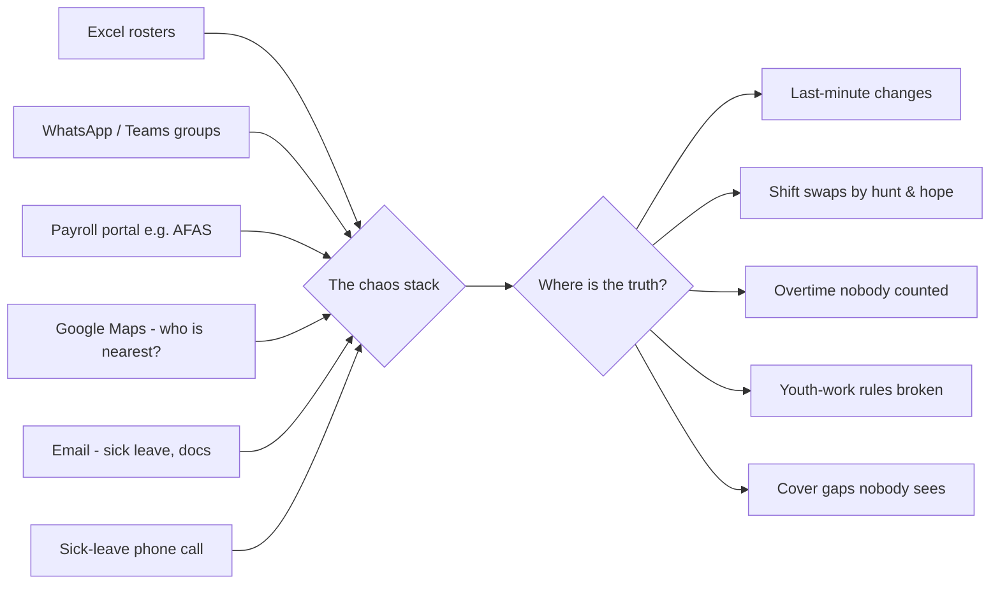

- **Scheduling** — one tool (often Excel).
- **HR / payroll admin** — something like AFAS (salary, vacation days, payouts, personal data).
- **Excel** — hour registration, ad-hoc rosters.
- **WhatsApp / Teams** — shift communication, last-minute changes, swap requests.
- **Google Maps** — team-leader guessing "who is the closest available".
- **External email** — sick leave, documents, requests.
- **Sick leave (ziekmelding)** — a phone call to a manager who then scrambles.
- **Shift swapping** — the "anyone want my Friday?" WhatsApp chain.

### The pain points we attack (top, evidence-based)

1. **Last-minute roster changes** dominate the day; predictability is the #1 retention driver.
2. **The roster has no status** — nobody can see a gap before it bites.
3. **Swap/cover dies in WhatsApp** — confirm flows without a system fail silently.
4. **Sick leave = chaos** — one-tap reporting, red shift, and cover suggestions are the fix.
5. **Youth/ATW legality is manual** — a 16-year-old's shift minus the rest rules is a fine.
6. **Admin time is enormous** — many venues spend ~3 hours/week on the roster that should take 30 minutes.

### How we win

- A roster **whose status is derived, never hand-set** (coverage vs `min_staff`) with a why-tooltip on every non-green shift.
- **Every change is tracked, approved, and notified** — the "no silent anything" rule.
- **Compliance-first pre-check at scheduling time**: rest, daily/weekly caps, 24h-oproep timestamp, 3-week publish, 39-Sundays counter, student age-bands.
- **First-class ziekmelding** with GDPR Art-9 safety and cover suggestions (not a solver).
- **Integrated payroll link** (Nmbrs first) — hours and absence flow to the payroll the venue already trusts.

---

## 4. Market & Competition

### Market context (derived from the 2026 landscape research)

- **~160 apps** catalogued in the workforce-scheduling / WFM space ([[plan2shift-landscape]]).
- Major rivals in NL: **Shiftbase, Dyflexis, Deputy, Roseman, Nmbrs (payroll), AFAS** plus smaller scheduling tools.
- Most competitors are **single-surface** (roster only, or time only, or payroll only) and treat **legal compliance as an afterthought**.
- The **horeca CAO + ATW youth-work rules** are our sharpest wedge: compliance checking at scheduling time is the #1 horeca differentiator.

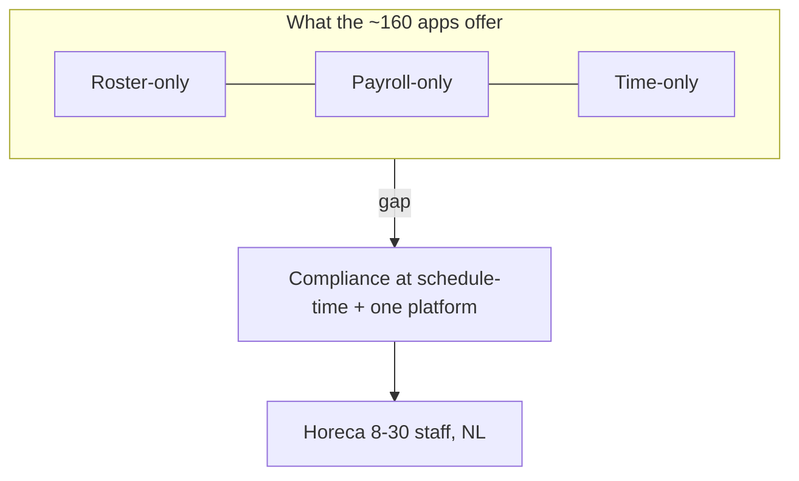

### Positioning map (qualitative)

| Axis | Typical competitor | Plan2Shift |
|---|---|---|
| Surface | Roster-only or payroll-only | Roster + time + absence + HR-ESS + payroll link, one platform |
| Compliance | Rules as afterthought / manual | Checked at schedule-time, hard-blocked (statutory) |
| SMB fit | Enterprise-heavy, high price | Free ≤5; €4/seat; founder-assisted pilots |
| Admin model | One admin does everything | 9-role Dutch permission matrix, role-filtered dashboard |
| Truth | Fragmented (WhatsApp + Excel + portal) | Single source of truth, every change notified |

### Target segment (Phase 1)

Horeca venues in the Netherlands, **8–30 employees**, mixed contracts including **student and nuluren**, **multi-vestiging (multi-location) a nice-to-have**. The 3 pilot venues are the beachhead.

---

## 5. Business Model & Unit Economics

### Pricing (resolved 2026-09-06)

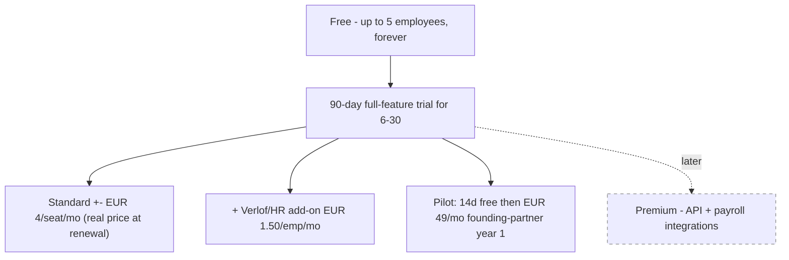

| Tier | Price | Notes |
|---|---|---|
| **Free** | €0, ≤5 employees | Forever; activation-based conversion (single venue). 90-day full-feature trial for 6–30. |
| **Standard** | €4/seat/mo | Early-bird renewal lock for pilot partners. Target 8–30 seats. |
| **Verlof/HR add-on** | €1.50/emp/mo | Multi-pot verlof balances + HR-ESS depth. |
| **Premium** | Later | Gates API + payroll integrations (Phase 2+). |
| **Pilot** | €0 for 14 days → **€49/mo founding-partner**, pilot year 1 | Concierge onboarding, free Nmbrs link, co-design perks, monthly ROI report. Real €4/seat renewal. |

### Unit economics (first pass, 2026-09-06 — model at 10 & 20 seats)

| | 10 seats | 20 seats |
|---|---|---|
| Revenue/mo | €40 | €80 |
| COGS/mo | ≈ €14 (support ≈ 85% of COGS) | ≈ €16 |
| **Gross margin** | **≈ 64%** | **≈ 80%** |
| CAC (blended) | ≈ €270 (concierge ~€450, self-serve ~€250) | |
| LTV @2% churn | ≈ €1,280 | ≈ €3,200 |
| LTV/CAC | ~4.7× | ~12× |
| Payback | ~10 mo | ~4 mo |

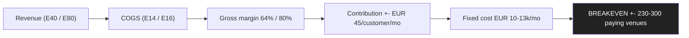

- Fixed (1–2 devs + infra): ≈ **€10.2–13.4k/mo** → **breakeven ≈ 230–300 paying venues**.
- **Not viable if**: churn ≥ 4%/mo, or blended contribution < €30/customer/mo.
- **Top viability risks**: churn > 2% (horeca seasonality), small-venue mix skew, CAC vs low ARPA. Countered by the Nmbrs link + compliance moat holding churn near 2%, and targeting ≥15-seat venues.

---

## 6. Roadmap at a Glance

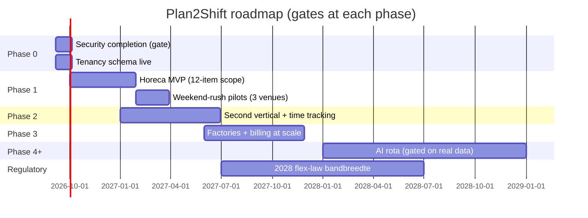

---

# L2 · THE PRODUCT LAYER

## 7. Personas & User Stories

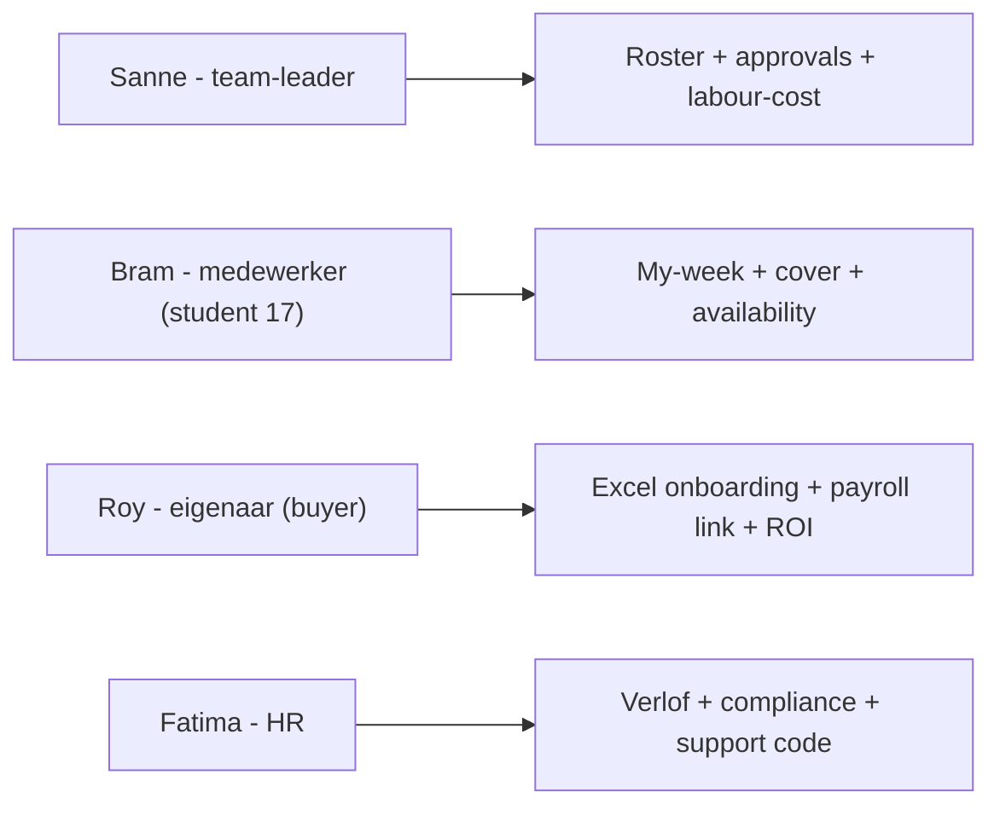

### P1 — Sanne, the team-leader (horeca) — *the daily power user*
"I want to see at a glance if Friday night is covered, and fix it in minutes, not WhatsApp spiral."
- **Stories**: sees green/yellow/red roster; gets a why-tooltip on any non-green shift; edits `min_staff` within guardrails; approves swaps on one card; sees planned-vs-actual labour cost before publishing.

### P2 — Bram, the medewerker (student, 17) — *the worker*
"I mustn't work illegal hours, and I want my shifts on my phone."
- **Stories**: one-tap ziekmelding (never obliged to find cover); my-week calendar with confirm/claim; availability control; live hours/earnings estimate; swap with pre-flight (age-band checked); always sees 3-week-published roster.

### P3 — Roy, the eigenaar (venue owner) — *the buyer*
"I want to stop spending 3h/week on the roster and get a payroll that just links."
- **Stories**: Excel onboarding → first roster in <1 hour; Nmbrs link "but not live" per-shift cost estimate; monthly ROI/nulmeting report (roster time 3h → 30min); pays the €49 founding-partner quietly because it pays for itself.

### P4 — Fatima, HR (growing multi-site restaurant group) — *the trust layer*
"I need verlof balances, contracts, and grief registration that comply."
- **Stories**: multi-pot verlof balance always visible (wettelijk/bovenwettelijk, FIFO, expiry reminders); contract types incl. nuluren/min-max/bandbreedte; compliance calendar; support-code shown for our own company on the support page.

---

## 8. Product Scope & Roadmap Detail

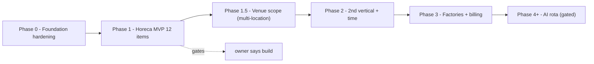

### Phase 0 — Foundation hardening (partially delivered)

**Delivered (2026-09-06, repo `823c711` → hardened through `5708154`):**
- Multi-tenant schema: `companies`, `company_members`, `company_support`, `support_audit`; JWT carries `company_id + role + token_version`.
- **9 canonical Dutch roles** + legacy aliases; **27-permission matrix** in `lib/permissions.ts` (single source of truth).
- Role-filtered `/dashboard` shell; server-computed permissions via `/api/auth/me`.
- **Auth hardening**: **HttpOnly cookie sessions** (no JWT in JS-accessible storage; `plan2shift_session` + `plan2shift_support` cookies), JWT revocation via `token_version`, body-size guard, **rate limits** (Cloudflare rule + in-memory limiter) on login/Turnstile/switch-company, Turnstile + disposable-email block, HSTS 1y at the edge, security headers/CSP.
- **TOTP support codes** (HR/Executive show code; Beheerder/Eigenaar/Ops jump-in, 1h audited support cookie).

**Remaining (gates everything):**
- Product schema beyond members: shifts, assignments, verlof pots, etc. (data-model section).
- Authenticated app shell for the product routes (`/dashboard` modules are the shell — feature pages come in Phase 1).
- GDPR ops: DPA Art 28, 52-week time-entry retention, EU residency.
- **Sentry + Resend/Queues: formally deferred to Phase 1** (not wired in Phase 0; see Integrations Matrix).

### Phase 1 — Horeca MVP (the authoritative scope: **12 items**, from [[plan2shift-prd]])

1. **Green/yellow/red roster** — coverage vs `min_staff`, status never hand-set; why-tooltip on every non-green shift.
2. **`min_staff` on shift templates** — seeded default, team-leader editable within guardrails (the dependency for 1/5/7).
3. **Published roster + change-approval** — publish ≥3 weeks ahead (horeca CAO); every change approves, notifies, and the employee confirms.
4. **Ziekmelding first-class** — one tap → red → plain-query cover suggestions; Art-9-safe (fact + expected return only); betermelding + basic verzuim% counter.
5. **Swap with pre-flight** — ATW rest + age-band re-validation at Accept and Approve; manager approval; mandatory notifications; single path.
6. **Horeca CAO minimal rules** — 3-week publish, 24h oproep, night 10% front-office, **39-Sundays counter**, holiday 100%; config, not hardcode.
7. **Student age-band legality** — birthdate → work-window/rest constraints + re-validation after swap; jeugdloon estimate. (*Defer* education-calendar input + 2028 bandbreedte enforcement → Phase 1.5/2.)
8. **Nmbrs write-side spike** — mock server first; Exact CSV + manual export as hard fallback; absence-CREATE rolling out 2026.
9. **Employee app essentials** — availability control; live hours/earnings estimate; **3-tier notifications**; SMS/QR/PWA login; payday hook.
10. **24h confirm/COVER reminder + capped cover marketplace** — open-shift posting + claimable cover pool + basic auto-repost (≤48h); reliability score/standby/cross-location stay Phase 2.
11. **Verlof basics** — multi-pot balance (wettelijk/bovenwettelijk), occupancy-aware request/approval + minimal reporting (coverage report + labour-cost report, Excel/CSV, scheduled-vs-actual).
12. **Excel onboarding + weekend-rush pilot** — import help, 2–4-week nulmeting/ROI report. **Pilots are charged**: 14-day free trial → €49/mo founding-partner (year 1), early-bird lock at €4/seat renewal.

**Explicitly OUT of Phase 1:** POS + public API · live/omzet labour-cost · swap marketplace/auto-repost/standby/reliability score · maps/proximity · clock-in/geofencing UI · education calendar + bandbreedte · payroll read-side · full verzuim re-integratie · jobs finder/internships/contractors.

### Phase 2 — Second vertical + time tracking + proximity

- **Second vertical**: pick ONE of retail, cleaning, or zorg-VVT (each profiled) — decide with a pilot employer.
- **Time tracking**: multi-surface clock-in (PWA + kiosk + web, one punch ledger), polygon geofence **notify-not-block**, offline-first punches, **fair rounding** (never company-favoring), auto-deduct breaks + audit trail, anti-fraud signals.
- **Labour-cost control & omzetgedreven planning** (POS-fed forecasting).
- **Maps proximity as a feature**: team-leader "nearest available per location" (zip/geocode + Haversine, consent-scoped; never live-tracking).
- **Payroll read-side live**: two-way with vendor — verified hours/vacation export; pay-info in ESS.
- **Multi-site requirements**: shared rota dual views, cross-site double-booking prevention, proximity-aware coverage, per-site budgets + CAO, mobility controls.
- **Verzuim re-integratie start**: bedrijfsarts integration, hervatting% + loondoorbetaling tracking.

### Phase 3 — Factories + reporting + scale
Multi-site switching, ploegendienst rotation patterns, ploegentoeslag vs ORT, ADV/RVU. Reporting (absence trends, coverage health, hours vs budget). **Stripe per-seat billing** to the free-≤5 wall. **Win-switches playbook**: lead with the payroll link, target renewals/post-payroll-error weeks, free migration + 2-week go-live, nulmeting ROI report, NL support + compliance checks. **Contractor/ZZP classification + equal-pay tracking** once the HR core exists.

### Phase 4+ — AI rota (gate: real data)
AI rota suggestions trained on real Phase 1–3 data — suggestions the planner approves, **never autonomous**. Web Push (Android-first, iOS caveats), PWA depth, multi-language. **Regulatory engine maturity**: jurisdiction/CAO notice-window rule engine, posted-schedule freeze, predictability-pay calculator, clopening/rest-gap blocker, **bandbreedte (2028) minimum-hours enforcement**.

---

## 9. Feature Deep-Dives

### 9.1 Cover state machine (`cover_requests`)

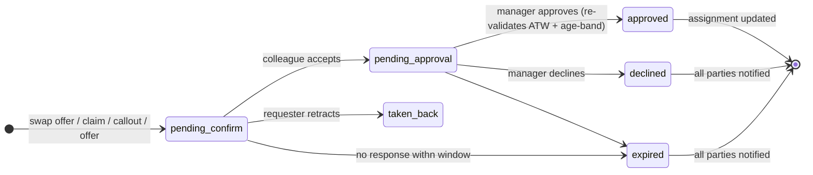

- **Replaces** the old `shift_assignments.swap_pending` flag. One path for swap/claim/callout/offer.
- **No silent rejection anywhere** — declined/expired/taken-back always notify all parties.
- Auto-repost via `repost_count + source='auto_repost'` (≤48h); revalidation timestamps gate Accept AND Approve.

### 9.2 Verlof pots (`leave_pots`)

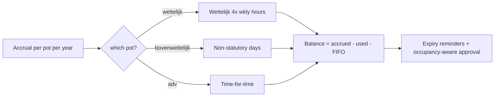

- Multi-pot balances: **wettelijk / bovenwettelijk / ADV**, per leave year.
- Balance = accrued − used (derived); **FIFO draw-down** at approval (oldest expiry first); expiry reminders.
- `leave_requests` carries `pot_id` + `consumed_hours`; occupancy-aware request/approval (never overbook the roster).

### 9.3 Comms & notifications (3-tier)

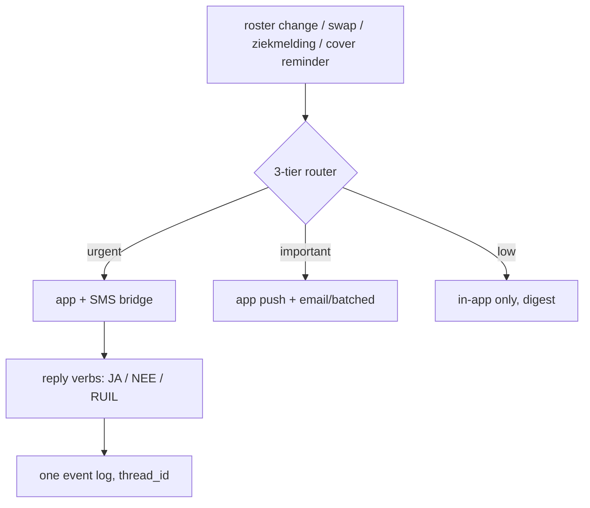

- **WhatsApp replacement**: every event in-app first; SMS bridge with masked numbers for workers off-app; reply verbs (`JA/NEE/RUIL`) re-enter the same event log.
- **Mandatory notifications on all changes/approvals** — the "bare confirm flows die in WhatsApp" lesson.

### 9.4 Ziekmelding (first-class, GDPR-safe)

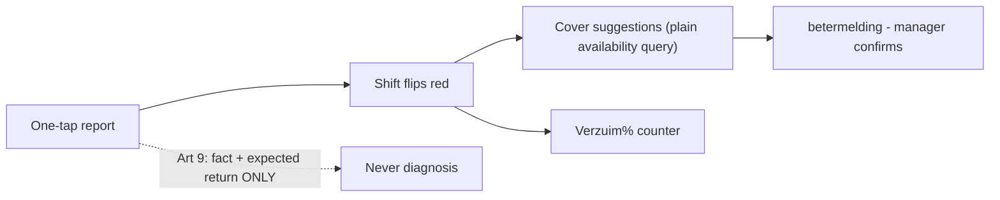

- One tap → shift flips red → **cover suggestions from plain availability queries** (not a solver);
- **Art 9 GDPR rule**: record only *fact + expected return date*, never a diagnosis; team-leader-side flow; sick worker is excused and **never obliged to find cover**; betermelding + verzuim% counter.

### 9.5 Roster engine

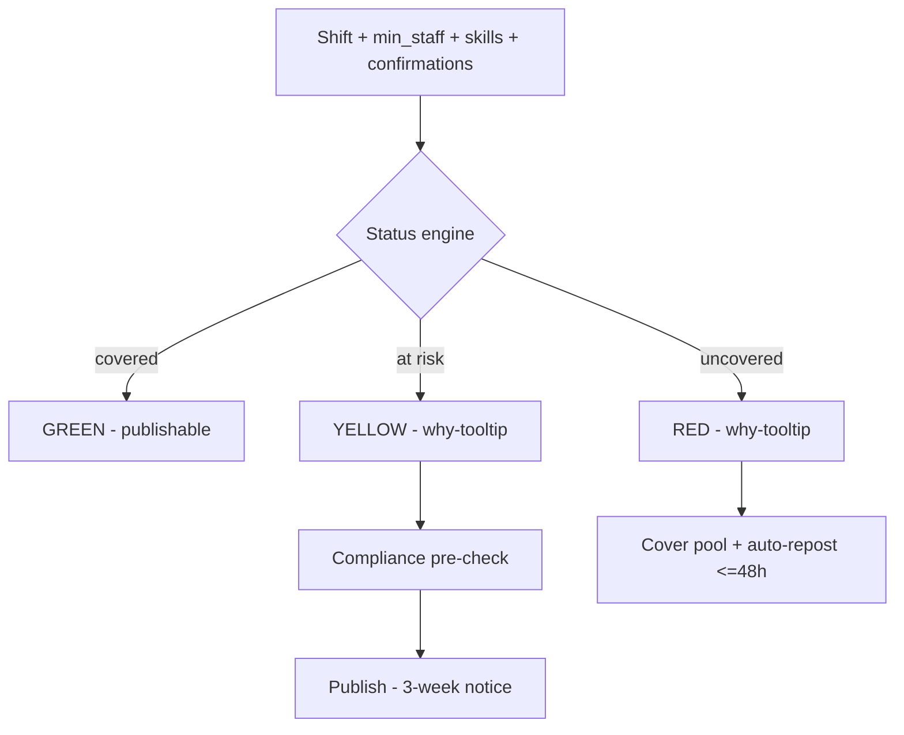

See data model + UX sections. Core: derived status (coverage vs `min_staff` vs skills vs confirmations, recomputed on every event); compliance pre-checks at schedule time with re-validation on swap (ATW rest, 12h/day, 60h/48h rolling, 24h-oproep timestamp, 3-week publish, youth age-bands, 39-Sundays).

---

## 10. UX Principles

1. **Status is derived, never hand-set.** Shift colors come from coverage vs `min_staff`; every non-green shift has a why-tooltip.
2. **The hero is the week grid** — team-leader week overlay + kanban cover-board (In / Out / Needs cover).
3. **Mobile-first for workers** — my-week calendar; PWA-first; SMS/QR login path for no-smartphone staff.
4. **One entry point for swaps** — three verbs (Give away / Trade / Request cover); surfaced eligibility reasons; one-card manager review; no status soup.
5. **No silent rejection** — every decline/expiry/take-back notifies all parties.
6. **No wage/cost data to workers** — employee my-week shows status, confirm/claim, hours-vs-contract only.
7. **Compliance as a whisper, not a wall** — legality reduces to a pre-check + a clear why, never a mystery block.
8. **Localized by role surface** — worker app multilingual-first; admin/legal content NL-only (curated, never MT).

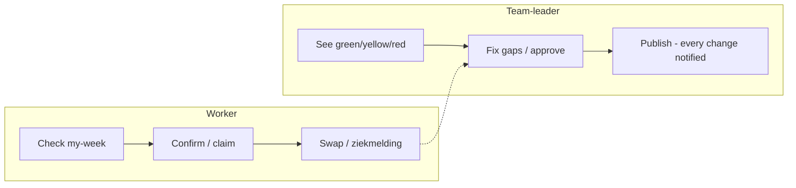

> Full spec: [[plan2shift-roster-ux]].

---

## 11. KPIs & Release Criteria

### Phase-1 success metrics (pilot)

| Metric | Target | Notes |
|---|---|---|
| Roster time per venue | 3h → **30 min/week** | The headline before/after |
| No-show % | **−40%** (aspirational) | Evidence: reminders alone may not move show-up (RCT) — treat as directional |
| Adoption | Weekly active, shift-confirm rate, cover-claim rate | |
| Nmbrs sync | % of hours with **zero re-entry** | |
| **Pilot success** | **2 of 3 pilot venues renew/commit** | The Phase-1 gate |

### Company-level KPIs (model viability)

- **Churn ≤ 2%/mo** (else LTV halves) · **GM ≥ 64% (10-seat) / 80% (20-seat)** · **CAC ≤ €300 blended** · **LTV/CAC ≥ 4×** · **Payback ≤ 6 mo** (needs ≥15 seats or add-ons).

### Activation funnel (how free becomes paid)

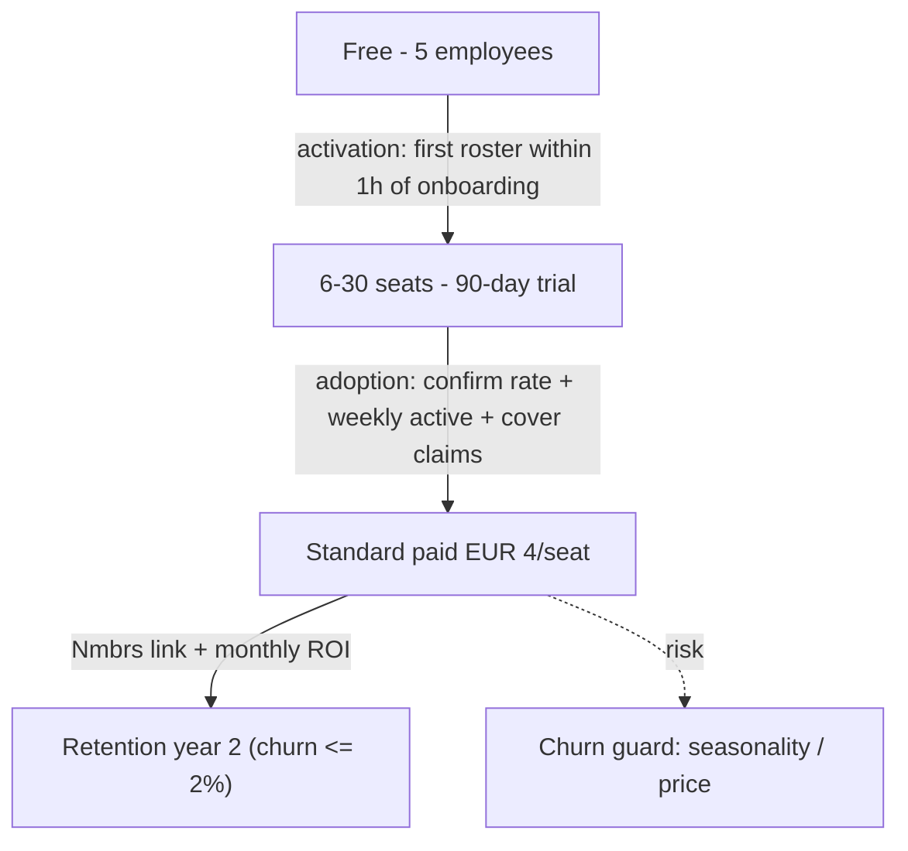

### Release criteria (definition of "done" per phase)

- **Phase 0 done**: security findings closed, HttpOnly cookie auth live, tenancy schema migrated, app shell auth-gated, GDPR ops documented.
- **Phase 1 done**: 12-item scope shipped + all acceptance criteria pass + 3 paid pilots live + 2/3 renew signal.
- **Phase 2 done**: second vertical pilot committed + clock-in live in production + payroll read-side live with one vendor.
- Every phase verifies with: lint/typecheck clean, CI isolation tests green, validation gates (Brain) green.

---

## 12. Localization Strategy

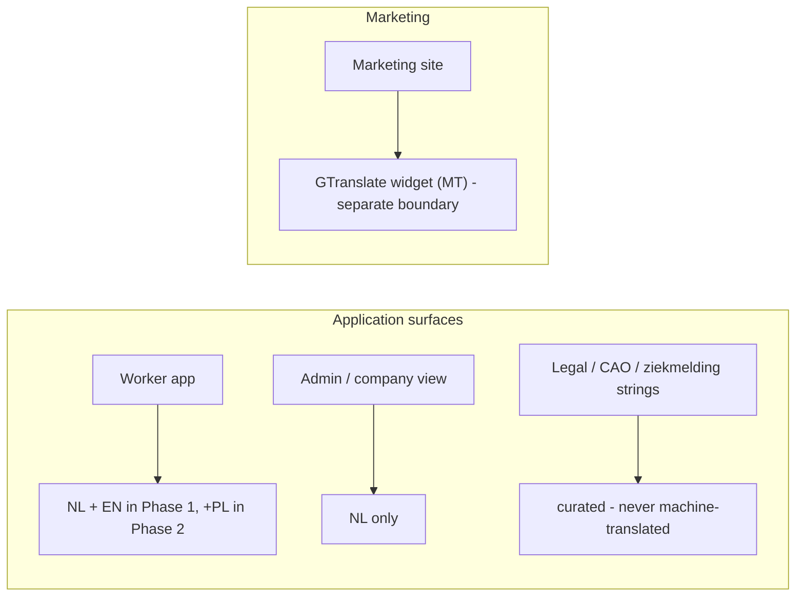

| Surface | Phase 1 | Phase 2+ |
|---|---|---|
| Worker app | **NL + EN** (multilingual-first) | + **PL** (staff ~20–30% non-Dutch) |
| Admin/company view | NL only | NL |
| Legal / CAO / ziekmelding strings | **Curated by us — never machine-translated** | Curated |
| Marketing site | GTranslate widget (MT) — **separate boundary** | Curated as budget allows |

**Rule:** MT is fine for the marketing site; the app's legal/CAO/ziekmelding strings are curated only. Keep the two boundaries separate.

> **Note (2026-09-06):** the marketing `/terms` page is now **Dutch** (curated, per the NL-only rule) — the canonical language for legal content. Other languages are served by the GTranslate widget on the marketing site.

---

## 13. Go-to-Market

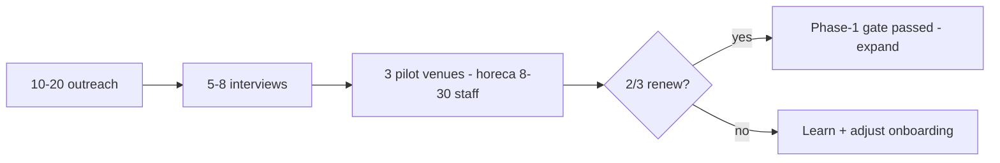

1. **Waitlist + landing** (Phase 0, live): headline "Maak af met last-minute roosters", objection sections, pre-qualifying waitlist form; **€49 founding-partner promise**; no AI overclaiming.
2. **Pilot funnel**: 10–20 outreach → 5–8 interviews → **3 pilot venues** (horeca, 8–30 staff, mixed contracts). Only "yes to a PAID pilot" onboard.
3. **Concierge onboarding**: Excel import help, free Nmbrs link, co-design perks, month repl: monthly ROI (nulmeting) report in weeks 2–4.
4. **Win-switches playbook** (Phase 3): target competitor renewals + post-payroll-error weeks; free migration + 2-week go-live.
5. **Sales assets ready**: pitch deck, landing/waitlist copy, ops runbook, comms design — all in the Brain.

---

# L3 · THE TECHNICAL LAYER

## 14. Architecture

```mermaid
flowchart LR
    subgraph Edge[Cloudflare edge]
        W[Workers + Hyperdrive pool]
        T[Turnstile at login]
        S[Static assets - Next.js export]
    end
    subgraph App[Next.js static export]
        A[app/ - dashboard, roles, auth]
        M[Marketing pages + GTranslate]
    end
    subgraph Data[Private network]
        DB[(MySQL - Mac Mini)]
        TUN["cloudflared access tcp :3306"]
    end
    User[Browser / PWA] --> W
    W --> S
    W --> A
    A -.build & deploy.-> W
    W -->|Hyperdrive: db.plan2shift.com:3306 (tunnel)| TUN --> DB
    W -->|turnstile verify| T
```

- **Next.js static export** (SSG) → Cloudflare Workers + **Hyperdrive** → **private MySQL** on the Mac Mini. Hyperdrive routes through the Cloudflare Tunnel at the internal hostname **`db.plan2shift.com:3306`**. `127.0.0.1:3307` is only the *local* HeidiSQL admin proxy on this PC (`docs/friend-heidisql-access.md`) — it is never part of the runtime request path.
- Every request scoped by `company_id` from the verified token (never from body/query); `hasPermission` gated server-side.
- Static assets `Cache-Control` public/immutable for `_next/static`; HTML `no-store`. CSP: `script-src 'self' 'unsafe-inline'` + Turnstile/GTranslate/Cloudflare Insights origins — **nonce/`strict-dynamic` was removed** because a per-response nonce broke hydration against edge-cached HTML on `plan2shift.com`.
- Simple, low-cost, one-region-first. Barely any COGS at pilot scale (≈€0.15–0.30/venue).

### Deployment & rollback

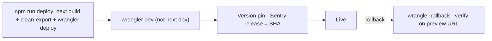

- `npm run deploy` = `next build && node scripts/clean-export.mjs && wrangler deploy`; test with `wrangler dev`.
- **Version pin + Sentry release = commit SHA**; rollback via `wrangler rollback` (near-instant), verify on the preview URL.
- Post-deploy pre-flight: `/api/health`, one login, `wrangler tail`.

---

## 15. Data Model

### Multi-tenancy (shipped; hardened in repo `5708154`)

```sql
companies       (id, name, industry, settings JSON, active, created_at, updated_at)
company_members (id, company_id, user_id, role, status active|invited)
company_support (id, company_id UNIQUE, totp_secret, enabled)
support_audit   (id, actor_user_id, company_id, at, ip)
users           (id, name, email UNIQUE, password_hash, token_version)
```

- A `users` row may belong to several companies (no tenant column on users); every future domain table is scoped by `company_id` (our `tenant_id`). **Login resolves the user's first active membership** — that single-company resolution is the intended behavior until venue-scoping (open question 1 / risk #10) lands.
- JWT: `{ sub, company_id, role, tv, iat, exp (24h) }`; support tokens add `scope: "support"` + `company_name`, `exp 1h`; `tv` = `token_version` (revocation on logout/password change).
- **9 canonical roles**: `medewerker, teamleider, planner, manager, hr, executive, beheerder, eigenaar, op` (legacy aliases map `worker→medewerker`, `admin→beheerder`, `owner→eigenaar`, …). Full matrix: `docs/roles-plan.md`.

### ER overview (target schema)

```mermaid
erDiagram
    COMPANIES ||--o{ COMPANY_MEMBERS : has
    USERS ||--o{ COMPANY_MEMBERS : joins
    COMPANIES ||--o| COMPANY_SUPPORT : secures
    COMPANIES ||--o{ SUPPORT_AUDIT : audited
    COMPANIES ||--o{ LOCATIONS : owns
    LOCATIONS ||--o{ SHIFT_TEMPLATES : defines
    SHIFT_TEMPLATES ||--o{ SHIFTS : instantiates
    SHIFTS ||--o{ COVER_REQUESTS : "covered by"
    EMPLOYEES ||--o{ SHIFT_ASSIGNMENTS : works
    SHIFTS ||--o{ SHIFT_ASSIGNMENTS : assigned
    EMPLOYEES ||--o{ LEAVE_POTS : accrues
    EMPLOYEES ||--o{ EMPLOYEE_SKILLS : holds
    SHIFT_TEMPLATES ||--o{ SHIFT_TEMPLATE_SKILLS : requires
    EMPLOYEES ||--o{ TIME_ENTRIES : punches
    COMPANY_MEMBERS ||--o{ USER_VENUE_ROLES : "venue-scope (Ph.1.5)"
    LOCATIONS ||--o{ USER_VENUE_ROLES : scopes
```

### Key tables & decisions

- **`cover_requests`** — 6-state machine (9.1); unifies swap/claim/callout/offer; `repost_count` for ≤48h auto-repost; revalidation timestamps gate Accept AND Approve.
- **`leave_pots`** — wettelijk/bovenwettelijk/ADV, FIFO, expiry, carry-over (9.2).
- **`employees`** — domain record separate from login account: birthdate (youth), cao_code, rate/jeugdloon tier, contract type `nuluren / min-max / bandbreedte / fixed`, `min_hours/max_hours_per_week`, flex_law_2028 flags.
- **Skills/certifications** — `employee_skills` (level, certificate_ref, expires_at, verified_by); feeds the red-status "required skill unfilled" + quick-fill.
- **Notifications + `contact_channels`** — channel (app/sms/email), masked handles, SMS opt-in + monthly usage cap; notifications with `reply_verb` (`JA/NEE/RUIL`) and `thread_id` back into the event log.
- **Isolation enforcement** — `tenant_id` derived from token only; central data-access module (`WHERE tenant_id = ?` structurally); uniform 404s; tenant-scoped views `WITH CHECK OPTION`; isolation tests in CI. *Hyperdrive note: `SET @tenant_id` does not persist between pooled queries — scope per query.*
- **Audit/GDPR** — `audit_logs` immutable; soft deletes everywhere; consent_at/consent_version; time_entries retention ≥52 weeks (ATW) then purge/anonymize; erasure = hard-delete employee + PII cascade (audit logs keep IDs only).

> Full schema + rationale: [[plan2shift-data-model]].

---

## 16. Security & Compliance

### Authentication flow (current)

```mermaid
sequenceDiagram
    participant B as Browser
    participant W as Worker API
    participant DB as MySQL
    B->>W: POST /api/auth/login (email, password, turnstileToken, remember)
    W->>DB: SELECT user + token_version + active membership
    DB-->>W: user + company_id + role
    W-->>B: Set-Cookie HttpOnly JWT (sub, company_id, role, tv, exp 24h)
    B->>W: GET /api/auth/me (cookie)
    W->>W: verify JWT + tv + hasPermission
    W-->>B: permissions[] (server-computed)
```

- **Turnstile** fail-closed at login (secret `env.TURNSTILE_SECRET`); **disposable-email rejection**; **body-size guard**; **per-IP rate limits** on login/Turnstile/switch-company (Cloudflare rule + in-memory limiter, per-IP + `cf.colo.id`); **JWT revocation** via `token_version`.
- **HttpOnly cookie auth is live**: sessions ride on `plan2shift_session` (+ `plan2shift_support` during support jump-in), `HttpOnly; Secure; SameSite=Lax`, with an Origin check on state-changing endpoints. The own session is preserved across support jump-in via the second cookie; `/api/auth/end-support` drops support scope; `/api/auth/session` is a stateless nav check. No JWT is readable by client JS.
- CSP: `script-src 'self' 'unsafe-inline'` + `challenges.cloudflare.com` + GTranslate origins + `static.cloudflareinsights.com`; HSTS `max-age=31536000; includeSubDomains`; HTML `no-store`; img-src opened for Commons/Turnstile/GTranslate; X-Frame-Options/referrer/permissions-policy set. **Nonce/`strict-dynamic` was removed** — edge-cached HTML on `plan2shift.com` broke hydration with a per-response nonce; `'unsafe-inline'` is the pragmatic, cache-safe standard for the Next.js static export.

### Compliance rules (the moat) — what blocks vs what advises

```mermaid
flowchart TD
    R{"Is the rule statutory ATW / youth / 3-week notice?"}
    R -->|yes| H["HARD-BLOCK at publish - non-negotiable"]
    R -->|no| A["ADVISORY - CAO preference/surcharge, config not hardcode"]
    H --> W["why-tooltip for the planner"]
    A --> W
```

- **Hard-block at publish** (statutory, non-negotiable): ATW rest (11h), 12h/day, 60h/48h rolling, youth work-windows, 3-week notice.
- **Advisory** (CAO preferences/surcharges): night 10% front-office, holiday 100%, 24h-oproep timestamp, 39-Sundays counter — config, not hardcode.
- **Youth/students**: birthdate-driven age-band engine; school-time-counts-as-work-time for 16–17y; re-validation after every swap; `jeugdloon` per-shift estimate.
- **2028 bandbreedte/flex-law**: contract min/max columns already designed; enforcement lands Phase 1.5/2.
- **GDPR**: Art 9 ziekmelding (fact only), DPA Art 28, 52-week retention, EU residency, consent versioning, erasure cascade.

### TOTP support jump-in

```mermaid
sequenceDiagram
    participant EX as Executive (own company)
    participant OPS as Beheerder/Eigenaar/Ops
    participant API as Worker API
    EX->>API: GET /api/company/support-code (support:show-code)
    API-->>EX: totp_secret (own company only)
    OPS->>API: POST /api/auth/switch-company companyId + code
    API->>API: rate-limit + TOTP validate (support:jump-in)
    API-->>OPS: Set-Cookie plan2shift_support (temp JWT scope=support exp 1h)
    API->>DB: INSERT support_audit (actor, company, ip)
```

HR/Executive show their own company's 6-digit code (30s, RFC 6238). Beheerder/Eigenaar/Ops enter a company's code → 1h temp support cookie `scope=support` (the own session cookie is preserved), always audited (`support_audit` row) + "Controlling Business" banner + **End Support** (`POST /api/auth/end-support` clears the support cookie). Rate-limited, secrets rotatable, never logged.

---

## 17. Integrations Matrix

```mermaid
flowchart LR
    core["Plan2Shift core"] --> N["Nmbrs - hours/absence write (P1 spike, P2 live)"]
    core --> E["Exact CSV fallback (P1)"]
    core --> I["iCal sync (P1)"]
    core --> S["SMS NL - off-app + reply verbs (P1)"]
    core --> Pos["POS Lightspeed/Bork (P2)"]
    core --> Pay["Payroll read-side (P2)"]
    core --> Str["Stripe/Mollie billing (P3)"]
```

| Integration | Purpose | Phase | Notes |
|---|---|---|---|
| **Nmbrs** | Hours/absence write-side (payroll) | Phase 1 spike, live P2 | REST v1, OAuth2 + X-Subscription-Key; free dev access; `variablehours` endpoint; mock-first |
| **Exact** | CSV export fallback | Phase 1 | Hard fallback if Nmbrs access stalls |
| **AFAS** | Payroll link | Phase 2 option | Single-pilot viable only; certification gates real |
| **iCal** | Calendar sync (tokenless) | Phase 1 | |
| **CSV fallback** | Export anytime | Phase 1 | Never leave a venue stuck |
| **Cloudflare** (Workers/Hyperdrive/Turnstile/Access) | Edge, DB tunnel, captcha | 0–4 | |
| **Sentry** | Error tracking, release-tagged | **Phase 1** (deferred from P0) | Not wired in Phase 0; add `SENTRY_DSN` secret + release pin |
| **Resend + Queues** | Transactional email | **Phase 1** (deferred from P0) | Not wired in Phase 0; add `RESEND_API_KEY`; contact form is still `mailto:` |
| **SMS provider (NL)** | Off-app notifications, reply verbs | Phase 1 | ~€0.045/message |
| **GTranslate** | Marketing site MT only | 0 | Never legal/CAO strings |
| **POS (Lightspeed/Bork)** | Live/omzet labour-cost | Phase 2 | |
| **Stripe/Mollie** | Per-seat billing | Phase 3 | iDEAL via Mollie for NL |

---

## 18. Operations

```mermaid
flowchart TD
    U["UptimeRobot on /api/health"] --> A{Incident?}
    A -->|site| S["Static: cf-cache-status"]
    A -->|api| W["Worker: /api/health, wrangler tail"]
    A -->|db| D[MySQL + Hyperdrive pool]
    A -->|tunnel| T[cloudflared alive + token valid]
    D --> R[Restore from encrypted backup]
```

- **Backups**: daily dump over tunnel (`mysqldump … --single-transaction …`), gzip; **RPO 24h / RTO ≤2h**; offsite **encrypted** copies (restic/rclone crypt — never raw in git); retention 14d + 4w + 3m; **monthly restore drill**.
- **Monitoring**: uptime + Workers logs (`wrangler tail --status error`) + Hyperdrive pool watch + Mac Mini host check (disk/memory/processes) → alert on symptoms, link to this runbook. Sentry (release-tagged) lands with Phase 1.
- **Secrets**: all via `wrangler secret put` — `AUTH_SECRET`, `TURNSTILE_SECRET` (Sentry/Resend secrets arrive with Phase 1); DB creds in the Hyperdrive binding; cloudflared **pinned v2026.5.1** (v2026.6.0 ignores service tokens, issue #1673), finite token expiry + notification; rotation = generate → deploy → verify → revoke.
- **Incident triage order**: site → worker → DB → tunnel; symptom map (503 = missing env/secret mismatch, 502 = Hyperdrive/DB, 401 = auth path); blameless postmortems with dated actions.
- **Public surface (shipped)**: `security.txt` at both `/.well-known/security.txt` and `/security.txt` (RFC 9116); `/terms` Terms & Privacy page; Cloudflare Web Analytics beacon (whitelisted in the CSP's `script-src`).
- **Support jump-in**: how we fix a pilot hands-on (see Security); test the full loop in Phase-0 pre-flight.

```mermaid
flowchart LR
    T0["Daily dump"] --> T1["gzip + encrypt"]
    T1 --> T2["Offsite (restic/rclone crypt)"]
    T2 --> T3["Retention 14d + 4w + 3m"]
    T3 --> T4["Monthly restore drill"]
```

> Full runbook: [[plan2shift-ops]].

---

## 19. Testing & Quality

```mermaid
flowchart LR
    Push[Commit] --> Lint[Lint + typecheck]
    Lint --> T[Unit + tenant-isolation tests]
    T --> V[Brain validation gates]
    V --> D[Deploy - build + clean-export + wrangler deploy]
    D --> PF[Post-deploy pre-flight]
```

- **CI gates**: lint + typecheck + unit tests; **tenant-isolation tests** (`@cloudflare/vitest-pool-workers`) — two-tenant fixtures, injected tenant params → 404/403.
- **Acceptance criteria** (from the PRD): status always derived + recomputed; swap cannot violate ATW/double-book/contract-max/skills (at Accept AND Approve); no silent rejection; student age-band re-validation on every swap; labour-cost sidebar before publish; no wage data to workers.
- **Performance**: Core Web Vitals on Workers Static Assets; `/_next/static` immutable caching; self-hosted fonts (WOFF2); preload only the LCP image; Lighthouse + CrUX; async jobs via Queues; static site regenerable from git (not a backup target).
- **Security testing**: dependency/secret scanning pre-commit (gitleaks); CSP review; payload caps; `harden` re-audit each pull.
- **Validation gates** (Brain): every commit runs `scripts/validate-ai-brain.mjs` — all wiki notes must pass.

---

# ALL · SHARED APPENDICES

## 20. Risks & Compliance Calendar

### Risk register

```mermaid
flowchart LR
    R1["Security debt (P0)"] --> G{Escalation gate}
    R2["Nmbrs access unverified"] --> G
    R3["Churn > 2%"] --> G
    G --> M["Mitigation: Phase-0 gate / fallbacks / moat + playbook"]
```

| # | Risk | Impact | Mitigation | Phase |
|---|---|---|---|---|
| 1 | Security debt (JWT in storage, no login rate-limit) | GDPR fines, account takeovers | **Resolved 2026-09-06** — HttpOnly cookie sessions, Cloudflare + in-memory rate limits, sitekey in env | 0 |
| 2 | Ziekmelding = GDPR Art 9 data | Fine + trust loss | Fact-only + expected-return; manager-confirm betermelding | 1 |
| 3 | Nmbrs production access unverified (partner/certification gates) | Payroll link stalls | Mock-first spike; Exact CSV + manual export fallback | 1 |
| 4 | `min_staff` undefined per venue | Hero roster blocked | Derived-from-contract baseline + guarded override (PRD item 2) | 1 |
| 5 | Scope creep | Never ships | Enforce the 12-item scope; deferrals explicit | 1 |
| 6 | Churn > 2%/mo (horeca seasonality) | LTV halves → not viable | Nmbrs link + compliance moat + win-switches playbook | ongoing |
| 7 | Small-venue mix skew free-≤5 cannibalization | Breakeven → 350+ venues | Target ≥15-seat venues; add-ons | ongoing |
| 8 | Single MySQL origin = SPOF | Data loss | RPO24h backups + restore drills + encrypted offsite | 0 |
| 9 | Marketing overclaims (AI badge, ISO/B-Corp footer) | Trust risk | Footer claims removed 2026-09-06 → honest "GDPR-ready · Hosted on Cloudflare"; audit any remaining claims before launch | 0/1 |
| 10 | Venue-scoping (multi-location) missing from company-level RBAC | Phase-1.5 delay | Layered `user_venue_roles`; design the JWT venue-claim then | 1.5 |

### Compliance calendar (track — verify official dates each renewal)

| Item | When | Action |
|---|---|---|
| **CAO Horeca term/surcharges** | Year-end | Refresh `cao_rules` data; re-verify night/holiday bands before each publish window |
| **ATW rest & youth windows** | Continuous | Engine-enforced (statutory hard-block) — no calendar action |
| **39-Sundays counter** | Continuous | Counter aggregate resets per year; publish-block when exhausted |
| **2028 flex-law bandbreedte** | 2028 | Minimum-hours enforcement of nuluren→bandbreedte; schema already future-proofed |
| **€1.50/seat verlof add-on & pricing** | Launch | Wire to Stripe billing in Phase 3 |

---

## 21. Glossary (Dutch → English)

| Dutch | English | Meaning in Plan2Shift |
|---|---|---|
| **Rooster** | Schedule / roster | The weekly shift plan; the hero surface |
| **Medewerker** | Employee / worker | Canonical worker role (legacy `worker`) |
| **Teamleider** | Team-leader | Runs the team roster, availability, approvals (legacy `teamleader`) |
| **Planner** | Planner | Makes rosters, templates, open shifts, publishes |
| **Manager** | Manager | Location overview, resource allocation, approvals |
| **Executive / Directie** | Executive / Board | Broad rights: financial, personnel, salary, reports |
| **Beheerder** | Admin | Everything in the company + business accounts + users & roles (legacy `admin`) |
| **Eigenaar** | Owner / Super Admin | As Beheerder + support jump-in (`owner`/`superadmin`) |
| **Ops** | Ops / Super Admin | Cross-company support via security code |
| **Ziekmelding** | Sick report | One-tap absence report; role-flips a shift red |
| **Betermelding** | Return-to-work report | Manager-confirmed end of absence |
| **Verlof** | Leave / vacation | Multi-pot leave balances (wettelijk/bovenwettelijk/ADV) |
| **Wettelijk verlof** | Statutory leave | 20 days/year (4× weekly hours) |
| **Bovenwettelijk verlof** | Non-statutory leave | Above-statutory days |
| **Adv (arbeidsduur verkorting)** | Time-for-time | Compensatory free time |
| **CAO** | Collective labour agreement | Sector rules (e.g. Horeca CAO) |
| **ATW** | Working Hours Act | Statutory rest/hours limits (Arbeidstijdenwet) |
| **Oproepkracht** | On-call worker | Called per shift (min 24h notice) |
| **Nulurencontract** | Zero-hours contract | No guaranteed hours |
| **Min-max / bandbreedte** | Min-max / band breadth | Guaranteed hours band (2028 flex-law) |
| **Jeugdloon** | Youth minimum wage | Age-tiered minimum wage |
| **Verzuim** | Absenteeism | Sickness absence & re-integration |
| **Poortwachter** | Gatekeeper (Sick Leave Act) | Re-integration obligations |
| **Ploegendienst** | Shift work (teams) | Factory rotation shifts |
| **Ploegentoeslag / ORT** | Shift premium / extra pay | Uneven-hours allowance |
| **Min-staff** | Minimum staffing | Coverage baseline per shift template |

---

## 22. Decision Log & Open Questions

### Locked decisions (owner-confirmed 2026-09-06)

```mermaid
flowchart LR
    D1["Payroll never re-implemented"] --> D2["Roster-first horeca P1"]
    D2 --> D3["13 decisions locked"]
    D3 --> D4["Dutch roles canonical + venue scoping P1.5 + TOTP jump-in adopted"]
```

1. **Payroll never re-implemented** — integrate Nmbrs/AFAS/Exact; "linked but not live" ESS shells + per-shift earnings estimates (labeled), live payslips Phase 2.
2. **Roster-first, horeca Phase 1** — *"the roster sells the session; HR-ESS sells the contract."*
3. **`min_staff`** derived-from-contract baseline + guarded team-leader override (warn below legal minimum).
4. **Location** Phase 2, zip + consent, platform-side matching; never live-tracking.
5. **Ziekmelding** Art-9-safe (fact only); sick worker excused, never obligated to find cover; poortwachter automation Phase 2+.
6. **Swap auto-approve default OFF**; per-shop opt-in.
7. **ATW/CAO caps**: hard-block publish for statutory; advisory for CAO prefs.
8. **Pricing**: free ≤5 forever + 90-day trial (6–30); €4/seat Standard; €1.50 add-on; **pilots charged** €49/mo founding-partner (year 1), early-bird €4 lock; 14-day free trial.
9. **Cover marketplace capped** into Phase 1 (≤48h auto-repost); reliability/standby/cross-location Phase 2.
10. **AI badge removed** from marketing (no overclaiming); AI rota gated on real data, planner-approved.
11. **Dutch canonical roles** adopted; **venue scoping = Phase-1.5 requirement**; **TOTP support jump-in adopted** as Ops capability (all 2026-09-06).

### Open questions

1. **Phase-1.5 venue RBAC design**: JWT currently holds a single `company_id + role` claim — decide per-venue tokens vs a second `venue_roles` claim before multi-site pilots.
2. **Second vertical choice** (retail / cleaning / zorg-VVT) — decide with a pilot employer.
3. **Activation metric definition** for free-≤5 → paid conversion (activation-based conversion assumption needs a concrete event).
4. **Nmbrs absence-CREATE rollout timing** (2026) — verification when the production access is obtained.
5. **Stripe vs Mollie for NL per-seat billing** — decide in Phase 3.
6. **AI rota scope** once real data exists (ratings, human-in-the-loop scope).

---

*This document is a living artifact generated from the machine-brain knowledge base ([[plan2shift-vision]] · [[plan2shift-plan]] · [[plan2shift-prd]] · [[plan2shift-evidence]] · [[plan2shift-unit-economics]] · [[plan2shift-data-model]] · [[plan2shift-ops]]). Companion files: `docs/roles-plan.md` (permission matrix).*